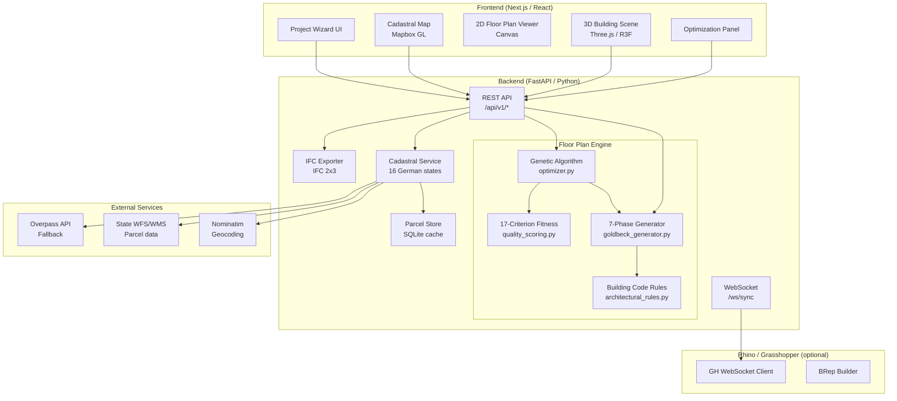

# Architecture Overview

## System Diagram



## Data Flow

1. **Plot Selection** — User selects parcels on the cadastral map. Parcels are fetched via a cache-first strategy: SQLite DB → WFS → Overpass → synthetic rectangle.

2. **Optimization** — User configures unit mix and weights, then starts the genetic algorithm. The GA evolves chromosomes encoding bay preferences, access type, room proportions, and staircase placement. Each chromosome is decoded by the 7-phase generator and scored by 17 fitness criteria.

3. **Visualization** — Results render in both 2D (canvas floor plans) and 3D (Three.js building scene with walls, windows, doors). Users can export to IFC or sync live to Rhino/Grasshopper via WebSocket.

## Generator Pipeline (7 Phases)

| Phase | Name | Input | Output |
|-------|------|-------|--------|
| 1 | Snap to Grid | Raw dimensions | Grid-aligned dimensions (62.5cm) |
| 2 | Select Access | Dimensions | Access type (Ganghaus/Laubengang/Spaenner) |
| 3 | Build Grid | Dimensions + access | StructuralGrid with bay widths and zones |
| 4 | Place Staircases | Grid | Staircase positions at legal bay boundaries |
| 5 | Allocate Apartments | Grid + stairs | Apartment slots per zone |
| 6 | Generate Rooms | Apartment slots | Room geometries (service strip → living) |
| 7 | Generate Elements | Rooms | Walls, doors, windows with openings |

## Key Directories

```
backend/
  app/
    api/v1/          # REST endpoints
    models/          # Pydantic data models
    services/
      floorplan/     # Generator + optimizer + rules
      cadastral.py   # 16-state parcel lookup
      ifc_exporter.py
      ws_sync.py     # Rhino live-sync
    database/        # SQLite engine + parcel store

frontend/
  src/
    app/             # Next.js pages (project wizard)
    components/
      three/         # 3D scene (R3F)
      floorplan/     # 2D floor plan canvas
      map/           # Cadastral Mapbox map
      optimization/  # GA controls + fitness chart
    hooks/           # useCadastral, useFloorPlan, useOptimization
    stores/          # Zustand state management
    types/           # API type definitions
```
